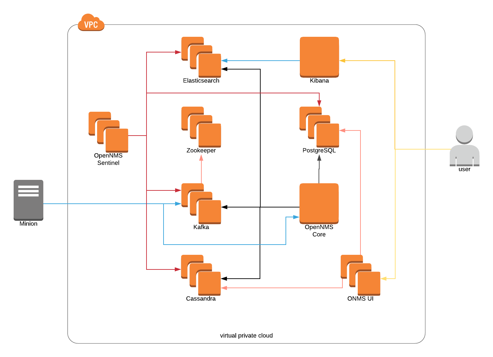

# OpenNMS Drift deployment in AWS for testing purposes



## Installation and usage

* Make sure you have your AWS credentials on `~/.aws/credentials`, for example:

```INI
[default]
aws_access_key_id = XXXXXXXXXXXXXXXXX
aws_secret_access_key = XXXXXXXXXXXXXXXXXXXXXXXXXXXXXXXXXX
```

* Install the Terraform binary from [terraform.io](https://www.terraform.io)

* Install the Packer binary from [packer.io](https://www.packer.io)

* Install VirtualBox from [virtualbox.org](https://www.virtualbox.org)

* Install Vagrant from [vagrantup.com](https://www.vagrantup.com)

* Tweak the versions on the packer initialization scripts located at `packer/scripts`.

* Tweak the common settings on `vars.tf`, specially `aws_key_name` and `aws_private_key`, to match the chosen region. All the customizable settings are defined on `vars.tf`. Please do not change the other `.tf` files.

* Build the custom AMIs using Packer:

```SHELL
cd packer
. build.sh
```

Of, in order to build a specific image:

```SHELL
cd packer
packer build opennms.json
```

* Execute the following commands from the repository's root directory (at the same level as the .tf files):

```SHELL
terraform init
terraform plan
terraform apply
```

* Generate the `/etc/hosts` file for the Minion system using `resources/minion/generate-hosts-files.pl`

* Initialize the Minion VM using Vagrant:

```SHELL
cd resources/minion
vagrant up
```

* Enjoy!

## Requirements

* OpenNMS version 22 or newer is required. For now, the script will use the RPMs from the `features/drift` branch. To change it, make sure to update the Packer initialization script for OpenNMS.

* Time synchronization is mandatory on every single device (including monitored devices). AWS guarrantees that, meaning the Minion and the Flow Exporters should also be synchronized prior start using this lab (either by using NTP or manual sync). 

## Design

The purpose here is understand the drift architecture, not using AWS resources like RDS, SQS, etc. to deploy OpenNMS on the cloud.

For this reason, everything will live on the same subnet (a.k.a. one availability zone) with direct Internet access through an Internet Gateway. All the EC2 instances are going to have a specific private IP address, registered against a local DNS through Route 53 and a dynamic public IP, which is how the operator can connect to each instance, and the way Minion will reach the solution.

Thanks to packer, all the required software will be part of the respective custom AMIs. Those AMIs should be re-created only when the installed software should be changed. Otherwise, they can be re-used, drastically reducing the time to have the EC2 instances ready, as they will just make configuration changes.

The architecture involves the following components:

* A pair of EC2 instances for ActiveMQ, configured using Network of Brokers, so OpenNMS and Minion can use it on a failover fashion, and the connection between the 2 brokers will guarrantee that all the messages will be delivered.

* A cluster of 3 EC2 instances for Cassandra/Newts.

* A cluster of 3 EC2 instances for Zookeeper (required by Kafka). 

* A cluster of 3 EC2 instances for Kafka.

* A cluster of 6 EC2 instances for Elasticsearch (3 dedicated master nodes, and 3 dedicated data/ingest nodes).

* A cluster of 2 EC2 instances for OpenNMS UI and Grafana.

* A pair of EC2 instances for PostgreSQL, configured as master/slave with streaming replication, using repmgr to simplify the operation.

* An EC2 instance for the central OpenNMS.

* An EC2 instance for Kibana.

* A elastic load balancer for the Elasticsearch instances.

* A elastic load balancer for the OpenNMS UI instances.

* Private DNS through Route 53 for all the instances.

For scalability, the clusters for Kafka, ES Data, Cassandra and ONMS UI can be increased without issues. That being said, the clusters for Zookeeper, and ES Master should remain at 3. Increasing the brokers on the AMQ cluster requires a lot more work, as the current design works on a active-passive fashion, as AMQ doesn't scale horizontally.

## Limitations

* Due to the asynchronous way on which Terraform initialize AWS resources, and how the EC2 instances initialize themselves, it is possible that manual intervension is rqeuired in order to make sure that all the applications are up and running. Errors can acoour even with the defensive code has been added to the initialization scripts.

* Be aware of EC2 instance limits on your AWS account for the chosen region, as it might be possible that you won't be able to use this POC unless you increase the limits. The default limit is 20, and this POC will be creating more than that.

* The OpenNMS UI servers have been configured to be read-only in terms of admintration tasks. So, even admin users won't be able to perform administration tasks, but user actions like acknowledging alarms are still available.

* Grafana doesn't support multi-host database connections. That means, the solution points to the master PG server. If the master server dies, the `grafana.ini` should be manually updated, and Grafana should be restarted on each UI server, unless a VIP and/or a solution like PGBounder or PGPool is used. For more information: https://github.com/grafana/grafana/issues/3676

* This is not a production ready deployment. This is just a proof of concept for all the components required to deploy Drift. Several changes are required not only on the EC2 instance types, but also on the configuration of all the components to make it production ready.

* The bootstrap scripts are very simple and are not designed to be re-executed, as they do not perform validations. Also, in order to get the runtime version of the scripts, the following command should be executed from the desired instance:

```SHELL
curl http://169.254.169.254/latest/user-data > /tmp/bootstrap-script.sh
```

## Future enhancements

* Improve the Elasticsearch cluster architecture to have a dedicated monitoring cluster (assuming X-Pack will be used).

* Combine all UI technologies into the same servers: OpenNMS UI, Kibana, Kafka Manager, etc.

* Provide a sample Curator implementation (on the ES master servers).
